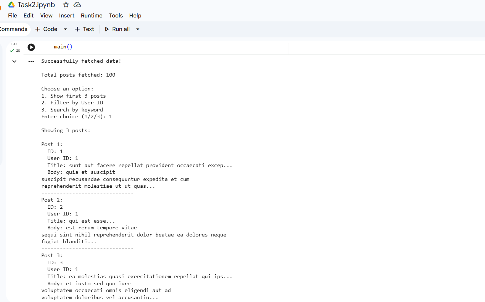

# API Data Fetcher

## Project Description
This project fetches data from a public API using the Python `requests` module.  
It parses JSON data and displays the results in a clean and readable format.

The project also includes:
- Search functionality
- Filtering functionality
- Proper API error handling

---

## Features
- Fetch API data using Requests
- Parse JSON responses
- Display formatted output
- Filter posts by User ID
- Search posts using keywords
- Handle API and connection errors

---

## Technologies Used
- Python
- Requests Library
- JSON Handling

---

## API Used
https://jsonplaceholder.typicode.com/posts

---

## How to Run

1. Install the requests module:

```bash
pip install requests
```

2. Run the script:

```bash
python main.py
```

---

## Menu Options
1. Show first 3 posts
2. Filter by User ID
3. Search by keyword

---

## Sample Output

The script successfully:
- Fetches API data
- Parses JSON response
- Filters posts
- Searches posts
- Displays formatted results

---

## Output Screenshot



---
